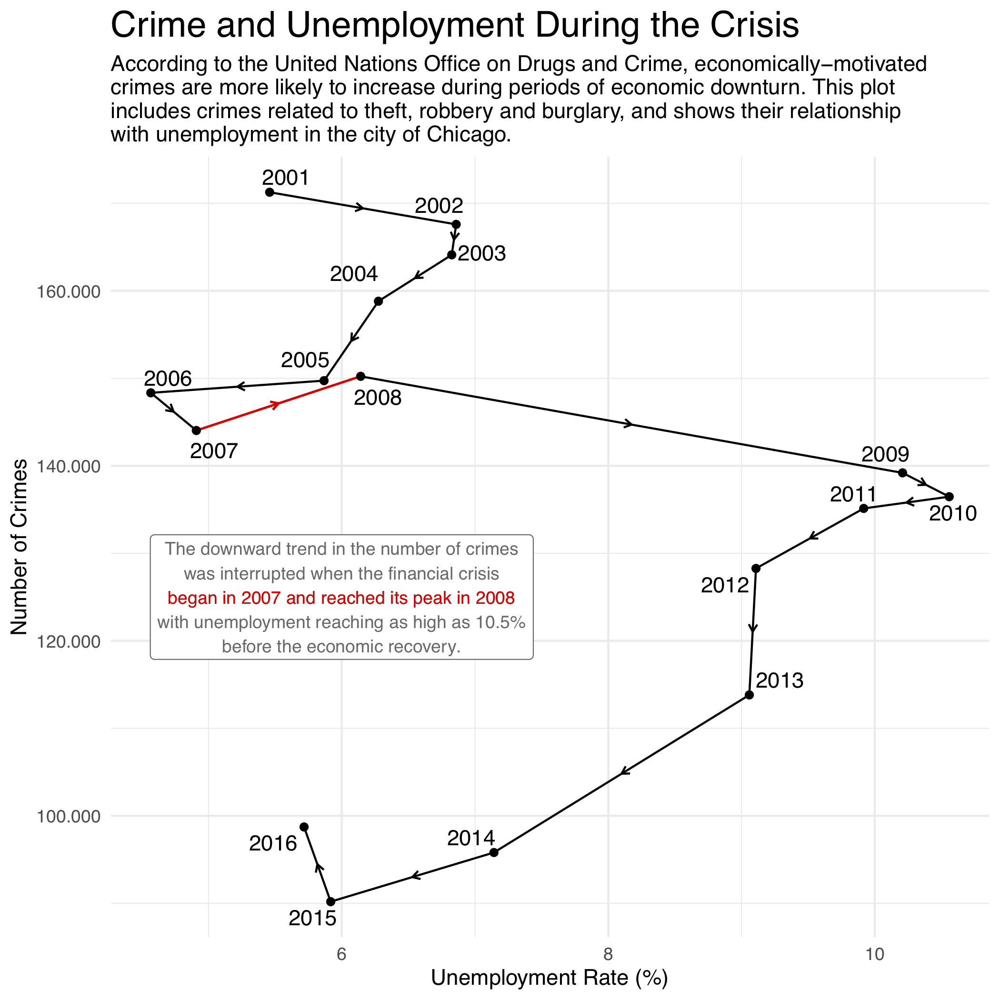

# Chicago Crimes Data Visualization

Data visualization allows faster communication – to better find patterns that would be impossible to see just by looking at the numbers and also provides the possibility to interact with the data itself.

For this project, we explored a [data set](https://data.cityofchicago.org/Public-Safety/Crimes-2001-to-present/ijzp-q8t2) about crimes in the city of Chicago in order to uncover insights and answer four different questions.

## Results of interest:

Please feel free to jump straight to the results:

* Interactive [Shiny app](https://vitorsb.shinyapps.io/chicago_crimes_economic/) where you can explore how socioeconomic indicators are related to the amount and types of crimes in different areas of Chicago.
* Check out the [report](report/DataVisualizationReport.pdf) with visualizations produced, such as:

Or, of course, you are welcome to [browse the code](https://github.com/vbernardes/chicago-crime-dataviz).
